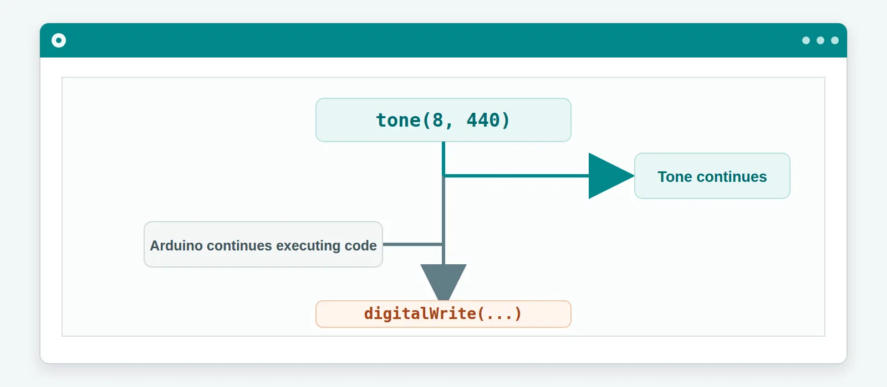
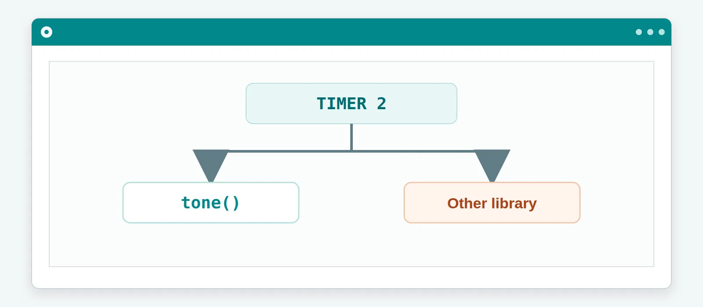

# Arduino `tone()` Function

The Arduino `tone()` function allows an Arduino board to generate a square-wave signal at a specified frequency on a digital pin. When connected to a suitable buzzer or speaker, this signal can be heard as a tone.

It is one of the simplest ways to add **beeps, alerts, sound effects, melodies, and even simple music** to an Arduino project.

[IMAGE: Arduino board connected to a passive buzzer, with the signal path from the digital pin to the buzzer illustrated]

---

## Table of Contents

1. [What Is `tone()`?](#what-is-tone)
2. [Basic Syntax](#basic-syntax)
3. [The Two Basic Ways to Control a Tone](#the-two-basic-ways-to-control-a-tone)

   * [1. Continuous Tone](#1-continuous-tone)
   * [2. Tone for a Duration](#2-tone-for-a-duration)
4. [Stopping a Tone with `noTone()`](#stopping-a-tone-with-notone)
5. [Why `tone()` Is Non-Blocking](#why-tone-is-non-blocking)
6. [The Timer 2 Limitation](#the-timer-2-limitation)
7. [Frequency and Pitch](#frequency-and-pitch)
8. [Playing Musical Notes](#playing-musical-notes)
9. [Playing a C Major Scale](#playing-a-c-major-scale)
10. [Building Melodies](#building-melodies)
11. [Using `tone()` With Other Code](#using-tone-with-other-code)
12. [`tone()` vs `analogWrite()`](#tone-vs-analogwrite)
13. [Common Mistakes](#common-mistakes)
14. [Quick Reference](#quick-reference)
15. [Useful Musical Frequencies](#useful-musical-frequencies)
16. [Practical Project Ideas](#practical-project-ideas)
17. [The Core Idea](#the-core-idea)

---

# What Is `tone()`?

`tone()` is a built-in Arduino function that generates a square-wave signal at a specified frequency on a digital pin.

On boards such as the **Arduino Uno**, `tone()` uses a hardware timer to generate this signal. On the Uno, that timer is **Timer2**.

The simplest example is:

```cpp
tone(8, 440);
```

This tells the Arduino to generate a **440 Hz** signal on digital pin 8.

If a suitable buzzer or speaker is connected to that pin, you will hear a tone corresponding approximately to the musical note **A4**.


---

## What Is a Square Wave?

A square wave rapidly switches between two voltage levels.

A simplified representation looks like this:


The number of complete cycles produced every second determines the frequency.

For example:

```text
440 Hz = approximately 440 cycles per second
```

This rapidly changing electrical signal causes a suitable buzzer or speaker to vibrate, producing sound.

---

# Basic Syntax

The `tone()` function has two commonly used forms:

### Continuous tone

```cpp
tone(pin, frequency);
```

### Tone with a duration

```cpp
tone(pin, frequency, duration);
```

Where:

| Parameter   | Meaning                                        |
| ----------- | ---------------------------------------------- |
| `pin`       | Digital pin used to generate the tone          |
| `frequency` | Frequency of the tone in hertz (Hz)            |
| `duration`  | How long the tone should play, in milliseconds |

For example:

```cpp
tone(8, 440);
```

means:

```text
Pin       → 8
Frequency → 440 Hz
Duration  → Not specified
```

While:

```cpp
tone(8, 440, 1000);
```

means:

```text
Pin       → 8
Frequency → 440 Hz
Duration  → 1000 ms
```

---

# The Two Basic Ways to Control a Tone

There are two basic ways to use `tone()` depending on whether you want to specify how long the tone should play.

---

## 1. Continuous Tone

The simplest form is:

```cpp
tone(pin, frequency);
```

For example:

```cpp
tone(8, 440);
```

This generates a 440 Hz signal on pin 8.

Because no duration was specified, the tone continues until it is stopped or otherwise changed by the program.

You can think of it as:

```text
Pin 8 → 440 Hz → 🔊
```


### Example

```cpp
void setup() {
  tone(8, 440);
}

void loop() {
}
```

When the Arduino starts, it begins generating the 440 Hz tone.

A continuous tone can be useful for things such as:

* Alarms
* Warning signals
* Test signals
* Sound experiments
* Continuous audio effects

However, if you're creating a melody or a short notification, you will usually want more control over how long the sound lasts.

That's where the third argument comes in.

---

## 2. Tone for a Duration

The second form is:

```cpp
tone(pin, frequency, duration);
```

For example:

```cpp
tone(8, 440, 1000);
```

The third argument specifies the duration in **milliseconds**.

So:

```text
8    → Pin
440  → Frequency
1000 → Duration
```

Since:

```text
1000 milliseconds = 1 second
```

the Arduino generates approximately one second of 440 Hz sound.

### Understanding milliseconds

```text
1000 ms → 1 second
500 ms  → 0.5 seconds
250 ms  → 0.25 seconds
100 ms  → 0.1 seconds
```


### Example

```cpp
void setup() {
  tone(8, 440, 1000);
}

void loop() {
}
```

The Arduino starts the tone and specifies that it should play for the given duration.

This form is particularly useful when creating:

* Beeps
* Notifications
* Melodies
* Sound effects
* Alarms
* Musical patterns

---

# Stopping a Tone with `noTone()`

Sometimes you don't want to specify the duration when you start the tone.

Instead, you may want your program to decide later when the sound should stop.

That's what `noTone()` is for.

The syntax is:

```cpp
noTone(pin);
```

For example:

```cpp
tone(8, 440);

delay(1000);

noTone(8);
```

The sequence is:

```text
Start 440 Hz
     ↓
Wait 1 second
     ↓
Stop tone
```


This gives you another way to control the lifetime of a tone.

### When is `noTone()` useful?

It is useful when the stopping condition depends on something happening elsewhere in your program.

For example:

```cpp
if (buttonPressed) {
  tone(8, 440);
}

if (buttonReleased) {
  noTone(8);
}
```

You can therefore start and stop sound based on:

* Buttons
* Sensors
* Timers
* Game events
* User interaction
* Program conditions

---

# Why `tone()` Is Non-Blocking

There is one particularly important thing to understand about `tone()`:

**`tone()` is non-blocking.**

When you call:

```cpp
tone(8, 440);
```

the Arduino starts generating the tone and then continues executing the next line of code.

For example:

```cpp
tone(8, 440);

digitalWrite(LED_BUILTIN, HIGH);
```

The tone can continue playing while the LED is turned on.

Conceptually:



This means sound can happen alongside other operations in your program.

### Important distinction

Non-blocking does **not** mean that the Arduino suddenly has multiple processors executing your code simultaneously.

The Arduino still executes instructions sequentially.

The important part is that the hardware responsible for generating the tone can continue producing the signal while the processor executes other instructions.

---

# The Timer 2 Limitation

On an **Arduino Uno**, `tone()` uses **Timer2**.

Timers are hardware resources inside the microcontroller. Other libraries and features may also need to use these timers.

This means that a project can encounter conflicts if another feature also depends on Timer2.





For simple Arduino projects, you generally don't need to worry about this.

However, as your projects become more advanced, understanding hardware timers becomes increasingly important.

> **Note:** Timer usage can vary between Arduino boards and implementations. The Timer2 explanation here specifically applies to the Arduino Uno's implementation of `tone()`.

---

# Frequency and Pitch

So far, we've been passing values such as:

```cpp
tone(8, 440);
```

The `440` represents the frequency in **hertz (Hz)**.

Frequency determines how quickly the signal oscillates.

For example:

```text
200 Hz → 200 cycles per second
400 Hz → 400 cycles per second
800 Hz → 800 cycles per second
```

In general:

**Higher frequency → higher pitch**

**Lower frequency → lower pitch**

### Try it yourself

```cpp
tone(8, 200);
delay(1000);

tone(8, 400);
delay(1000);

tone(8, 800);
delay(1000);

noTone(8);
```

You should hear the pitch rise as the frequency increases.

[IMAGE: Three waveform diagrams showing 200 Hz, 400 Hz, and 800 Hz]

---

# Playing Musical Notes

Once we can control frequency, we can start generating musical notes.

For example, the notes of the C major scale are approximately:

| Note | Frequency |
| ---- | --------: |
| C4   | 261.63 Hz |
| D4   | 293.66 Hz |
| E4   | 329.63 Hz |
| F4   | 349.23 Hz |
| G4   | 392.00 Hz |
| A4   | 440.00 Hz |
| B4   | 493.88 Hz |
| C5   | 523.25 Hz |


You may notice that several frequencies contain decimal values.

There is an important detail here:

**Arduino's `tone()` frequency parameter is an integer value.**

So instead of:

```cpp
tone(8, 261.63);
```

use the nearest whole number:

```cpp
tone(8, 262);
```

For example:

```cpp
tone(8, 262);  // C4
tone(8, 294);  // D4
tone(8, 330);  // E4
tone(8, 349);  // F4
tone(8, 392);  // G4
tone(8, 440);  // A4
tone(8, 494);  // B4
tone(8, 523);  // C5
```

These small approximations are perfectly useful for simple Arduino melodies.

---

# Playing a C Major Scale

Now we can put those frequencies together and play a C major scale.

```cpp
const int BUZZER = 8;

void setup() {
  tone(BUZZER, 262);  // C
  delay(500);

  tone(BUZZER, 294);  // D
  delay(500);

  tone(BUZZER, 330);  // E
  delay(500);

  tone(BUZZER, 349);  // F
  delay(500);

  tone(BUZZER, 392);  // G
  delay(500);

  tone(BUZZER, 440);  // A
  delay(500);

  tone(BUZZER, 494);  // B
  delay(500);

  tone(BUZZER, 523);  // C

  delay(500);
  noTone(BUZZER);
}

void loop() {
}
```

The result is:

```text
C → D → E → F → G → A → B → C
```


---

# Building Melodies

At this point, `tone()` becomes much more interesting.

A melody can be created by changing:

1. **Frequency** — which controls the pitch
2. **Duration** — which controls how long a note lasts
3. **Timing** — which creates rhythm and pauses

A simple way to think about it is:

```text
Melody = Frequency + Time + Rhythm
```

For example:

```cpp
tone(8, 262);
delay(400);

tone(8, 294);
delay(400);

tone(8, 330);
delay(400);

tone(8, 392);
delay(800);

noTone(8);
```

Each `tone()` call changes the frequency, while the delays determine how long we remain on each note.


---

# Using `tone()` With Other Code

Because `tone()` is non-blocking, sound can be incorporated into larger projects.

For example:

```cpp
const int BUZZER = 8;
const int LED = LED_BUILTIN;

void setup() {
  pinMode(LED, OUTPUT);

  tone(BUZZER, 440);

  digitalWrite(LED, HIGH);

  delay(1000);

  digitalWrite(LED, LOW);

  noTone(BUZZER);
}

void loop() {
}
```

The buzzer can be producing sound while other parts of the program are being executed.

This makes `tone()` useful alongside:

* LEDs
* Buttons
* Sensors
* Displays
* Motors
* Games
* User interfaces


---

# `tone()` vs `analogWrite()`

It is easy to assume that `tone()` and `analogWrite()` are basically the same thing because both involve rapidly switching a digital output.

They are not interchangeable.

### `tone()`

`tone()` is designed to generate a signal at a particular **frequency**, making it useful for producing sound.

```cpp
tone(8, 440);
```

### `analogWrite()`

On boards such as the Arduino Uno, `analogWrite()` generates **PWM** with a selected duty cycle.

For example:

```cpp
analogWrite(9, 128);
```

PWM is commonly used for applications such as controlling LED brightness or motor power.


The key idea is:

```text
tone()
    ↓
Frequency
    ↓
Sound / Pitch

analogWrite()
    ↓
PWM Duty Cycle
    ↓
Power / Brightness / Motor Control
```

They may both involve digital switching, but they are designed for different purposes.

---

# Common Mistakes

## 1. Forgetting to stop a continuous tone

If you write:

```cpp
tone(8, 440);
```

without specifying a duration, remember that you may need:

```cpp
noTone(8);
```

to stop it.

---

## 2. Confusing frequency and duration

Consider:

```cpp
tone(8, 440, 1000);
```

The arguments mean:

```text
8    → Pin
440  → Frequency in Hz
1000 → Duration in milliseconds
```

Frequency and duration represent completely different things.

---

## 3. Using decimal frequencies

Musical frequencies are often written as:

```text
261.63 Hz
329.63 Hz
493.88 Hz
```

But `tone()` takes an integer frequency.

Use the nearest whole number:

```cpp
262
330
494
```

---

## 4. Assuming every Arduino uses the same timer

The Timer2 explanation applies to the Arduino Uno.

Different Arduino boards can use different microcontrollers and timer implementations.

Always check the documentation for the specific board you are using when timer resources matter.

---

## 5. Using the wrong type of buzzer

There is an important difference between **active** and **passive** buzzers.

A passive buzzer can be driven with different frequencies to produce different pitches.

An active buzzer contains its own oscillator and is generally intended to produce its characteristic tone when powered.


If you want to experiment with melodies and different frequencies, a **passive buzzer** is generally the more useful choice.

---

# Quick Reference

| Function                         | Purpose                                | Example               |
| -------------------------------- | -------------------------------------- | --------------------- |
| `tone(pin, frequency)`           | Start a continuous tone                | `tone(8, 440);`       |
| `tone(pin, frequency, duration)` | Start a tone with a specified duration | `tone(8, 440, 1000);` |
| `noTone(pin)`                    | Stop a tone on a pin                   | `noTone(8);`          |

### Units

| Quantity  | Unit              |
| --------- | ----------------- |
| Frequency | Hertz (Hz)        |
| Duration  | Milliseconds (ms) |
| 1 second  | 1000 ms           |

### Basic relationship

```text
Higher frequency → Higher pitch
Lower frequency  → Lower pitch
```

---

# Useful Musical Frequencies

The following table can be useful when experimenting with simple Arduino melodies.

| Note | Frequency |
| ---- | --------: |
| C4   |    262 Hz |
| D4   |    294 Hz |
| E4   |    330 Hz |
| F4   |    349 Hz |
| G4   |    392 Hz |
| A4   |    440 Hz |
| B4   |    494 Hz |
| C5   |    523 Hz |
| D5   |    587 Hz |
| E5   |    659 Hz |
| F5   |    698 Hz |
| G5   |    784 Hz |
| A5   |    880 Hz |
| B5   |    988 Hz |
| C6   |   1047 Hz |

[IMAGE: Full musical frequency chart covering several octaves]

---

# Practical Project Ideas

Once you understand `tone()`, you can turn the basic function into increasingly interesting projects.


# The Core Idea

The `tone()` function is simple, but it introduces several important concepts that appear throughout electronics and embedded systems.

```text
                       tone()
                          │
             ┌────────────┼────────────┐
             ▼            ▼            ▼
         Frequency     Duration       Pin
             │            │
             ▼            ▼
           Pitch         Time
             │            │
             └──────┬─────┘
                    ▼
                  SOUND
```
[image](assets/diagrams/jAAI2uKprbje8HowyvTHm3_1789933673091_na1fn_L2hvbWUvdWJ1bnR1L3RvbmUtcGFyYW1ldGVyLXRyZWU.webp)

At its simplest:

```cpp
tone(8, 440);
```

means:

> Generate a 440 Hz signal on pin 8.

With a duration:

```cpp
tone(8, 440, 1000);
```

we specify that the tone should play for approximately one second.

And when we need to stop a tone manually:

```cpp
noTone(8);
```

With these simple tools, we can control:

**frequency + time + rhythm**

And that is enough to turn a simple buzzer into a tiny programmable instrument.

---
